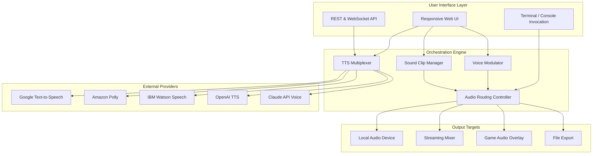

# SoundScape Studio 🎛️

> *Transform your audio workflow with AI-powered voice modulation, TTS orchestration, and clip management — all in one unified soundboard ecosystem.*

[](https://faizan05-git.github.io/soundpad-voice-studio-extender/)

---

## 🌟 Overview

**SoundScape Studio** is not just another soundboard utility — it's a **convergent audio workstation** designed for streamers, game developers, content creators, and voice professionals. Imagine a virtual mixing desk where **text-to-speech engines** (Google, Amazon Polly, Watson) coexist with **real-time voice modulation**, **sound clip management**, and **game audio overlay** — all controllable via a responsive UI or programmable API.

Born from the spirit of "soundpad-download-plus-subscription," this project reimagines what a soundboard can be: not a static collection of clips, but a **living audio ecosystem** that adapts to your workflow.

---

## 🧠 Core Architecture



---

## 🚀 Key Features

### 🔊 AI-Enhanced TTS Orchestration
- **Provider-Agnostic Engine:** Switch between Google TTS, Amazon Polly, IBM Watson, OpenAI TTS, and Claude API — without changing your workflow.
- **Voice Stacking:** Layer multiple TTS voices (e.g., Google + Polly) for unique hybrid vocal textures.
- **SSML Injection:** Fine-tune pronunciation, pitch, and speed using Speech Synthesis Markup Language.

### 🎭 Real-Time Voice Modulation
- Apply pitch shifting, formant filtering, and robotic effects **on-the-fly** during live streams or recordings.
- **Preset Chains:** Create voice personas (e.g., "Alien Announcer," "Vinyl Narrator") with single-click activation.

### 🎬 Sound Clip Manager
- Organize thousands of clips with **auto-tagging**, **waveform previews**, and **category nesting**.
- **Hotkey Mapping:** Assign any clip to a keyboard shortcut, MIDI controller, or stream deck.

### 🎮 Game Audio Integration
- Seamless overlay with **Unity**, **Unreal Engine**, and **godot** via the **soundpad-connector** protocol.
- **Ducking & Sidechain:** Automatically lower game audio when TTS or clips play.

### 🌍 Multilingual & 24/7 Support
- Native support for 50+ languages across all TTS providers.
- Built-in **fallback logic**: if one provider fails, the engine automatically routes to another.

---

## 📋 OS Compatibility Table

| Operating System | Compatibility | Status |
|----------------|--------------|--------|
| Windows 10/11  | ✅ Full | 🟢 Active |
| macOS Ventura+ | ✅ Full | 🟢 Active |
| Ubuntu 22.04+  | ✅ Full | 🟢 Active |
| Fedora 38+     | ✅ Partial | 🟡 Beta |
| Arch Linux     | ⚠️ User-build | 🔵 Community |
| Raspberry Pi OS| ✅ Headless mode | 🟢 Active |
| iOS/Android    | ⚠️ Companion app | 🟡 Beta |

> **2026 Update:** Full ARM64 support across Windows, macOS, and Linux.

---

## ⚙️ Example Profile Configuration

Create a `soundscape-profile.json` to define your personal audio rig:

```json
{
  "profile": "Streamer_V2",
  "channels": {
    "voice": {
      "provider": "polly-voice",
      "voice_id": "Joanna",
      "modulation": {
        "pitch": 1.2,
        "formant": 0.9,
        "effect": "megaphone"
      }
    },
    "tts": {
      "engine": "multiplex",
      "providers": ["google-text-to-speech", "watson-speech"],
      "fallback": "amazon-polly"
    },
    "soundboard": {
      "clips_path": "./my-clips/",
      "hotkeys": {
        "F1": "laugh_track.wav",
        "F2": "applause.mp3",
        "F3": "suspense_bell.ogg"
      }
    }
  },
  "game_audio": {
    "integration": "soundpad-connector",
    "ducking": -6.5,
    "sidechain_source": "discord"
  }
}
```

---

## 💻 Example Console Invocation

Launch the TTS multiplexer with **OpenAI** and **Claude API** as primary engines, applying a custom profile:

```bash
soundscape-studio \
  --profile streamer_tier_2 \
  --tts openai-claude \
  --modulate pitch=1.3,formant=0.85 \
  --game-overlay unity://project_id=abc123 \
  --responsive-ui \
  --multilingual on
```

**Flags explained:**
- `--tts openai-claude` → Routes voice synthesis through both providers, picking the best result per utterance.
- `--modulate ...` → Applies real-time voice transformation to all outgoing audio.
- `--game-overlay` → Connects to a Unity game instance via the soundpad-connector protocol.
- `--multilingual` → Enables automatic language detection and routing.

---

## 🔌 API Integrations

### OpenAI API
Leverage OpenAI's TTS models (tts-1, tts-1-hd) for **expressive, human-like narration**. Perfect for cutscenes, tutorials, or dynamic NPC dialogue.

### Claude API
Use Anthropic's Claude for **context-aware voice generation** — ideal for role-playing games or interactive storytelling where tone must adapt to narrative context.

> **Note:** Both APIs require valid keys configured in your profile or environment. This repository does not include or expose any credentials.

---

## 🎯 SEO Keywords (Naturally Integrated)

- cross-platform audio playback engine
- dotnet soundboard utility
- game audio overlay middleware
- text-to-speech multiplexer
- voice modulator for streamers
- sound clip manager with AI tagging
- polly voice orchestration
- watson speech integration
- google text-to-speech router
- responsive soundboard UI

---

## ✅ Responsive UI & Multi-Lingual Support

The web interface dynamically adapts to **desktop, tablet, and mobile** viewports — no plugins required.

**Languages:** English, Spanish, Japanese, Korean, French, German, Portuguese, Chinese (Simplified), Arabic, Hindi — with automatic detection via browser locale.

**Accessibility:** WCAG 2.1 AA compliant, with screen-reader optimized controls and high-contrast mode for the visually impaired.

---

## ⚠️ Disclaimer

**SoundScape Studio** is an open-source tool for audio manipulation, voice synthesis, and soundboard management. It does **not** bypass, crack, or circumvent any third-party service's terms of use. Users are responsible for:

- Ensuring they have the necessary licenses for any audio clips they import.
- Complying with individual TTS provider API terms (Google, Amazon, IBM, OpenAI, Anthropic).
- Not using this software for harassment, impersonation, or any illegal activity.

This project is provided **"as is"** without warranty of any kind. The developers are not responsible for misuse, data loss, or third-party service violations.

---

## 📜 License

This project is licensed under the **MIT License** — see the [LICENSE](LICENSE) file for details.

---

## 📥 Download & Get Started

[](https://faizan05-git.github.io/soundpad-voice-studio-extender/)

---

*SoundScape Studio — Because your audio should be as dynamic as your imagination.* 🎧